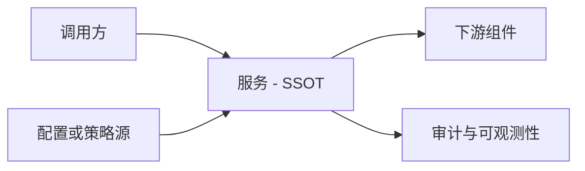
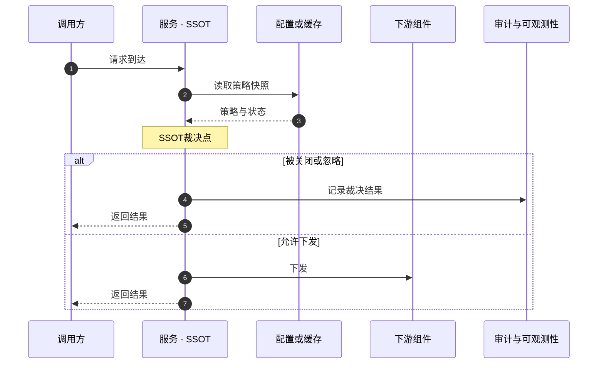
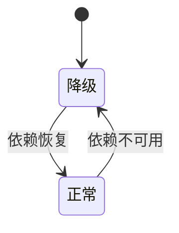

# RFC Template (OS/Platform Service)

> **Load**: DESIGN phase (full text). Also used in INIT to generate rfc.md skeleton (headings only).
> **Purpose**: Structural skeleton for rfc.md. Agent fills each section per the requirements gathered in DISCOVER.
> **Companion refs**: `design_assets.md` for SCN/DEC writing format; `methodology.md` for rules/constraints.

## Section Index

| § | Title | Layer | Key Deliverables |
|---|-------|-------|-----------------|
| 1 | 一页结论 | Review | TL;DR 结论 + 阅读指南 + 关键索引 |
| 2 | 背景 | Review | Context + motivation |
| 3 | 用户痛点 | Review | User-perceivable problems (no internal terms) |
| 4 | 目标与非目标 | Review | Verifiable goals + success criteria table + glossary |
| 5 | 方案概览 | Review | End-to-end flow + contracts + API design (if applicable) + diagrams A/B/C with Notes |
| 6 | 影响分析与兼容性 | Review | API behavior + API compatibility + breaking changes + rollback + evidence |
| 7 | 关键决策与取舍 | Normative | DEC-### + Unresolved (Hard/Soft) |
| 8 | 安全模型 | Normative | SEC-HR rules → rationale → SCN → evidence |
| 9 | 可靠性与健壮性 | Normative | REL-HR rules → rationale → SCN → invariants |
| 10 | 可观测性 | Normative | Minimum observability requirements + SCN binding |
| 11 | 验收 | Normative | 5-category SCN + must-pass + risk coverage matrix |
| 14 | 门禁声明 | Appendix | Trigger YES/NO + Links (Gate-A checks this) |
| 16 | 附录 | Appendix | Roles + 11-item self-check + document meta |

## Table of Contents

| § | Title | Audience |
|---|-------|----------|
| 1 | 一页结论 / TL;DR | **All** — 2 min overview |
| 2 | 背景 | PM / Arch |
| 3 | 用户痛点 | PM / Stakeholder |
| 4 | 目标与非目标 | PM / Arch / QA |
| 5 | 方案概览 | Arch / Dev |
| 6 | 影响分析与兼容性 | Arch / QA / PM |
| 7 | 关键决策与取舍 | Arch / Reviewer |
| 8 | 安全模型 | Security / Arch |
| 9 | 可靠性与健壮性 | Arch / SRE |
| 10 | 可观测性 | SRE / Dev |
| 11 | 验收 | QA / Dev / Reviewer |
| 12 | 变更记录 | All |
| 14 | 门禁声明 | Gate-A / CI |
| 15 | 发布与影响元信息 | PM / Release |
| 16 | 附录 | All |

---

# RFC-YYYYMMDD：<标题>

## 1. 一页结论
> 目标：评审 2 分钟内知道"做什么、影响谁、最大风险、怎么验收"。

### 1.1 结论（3–6 条）
- <做什么> / <安全边界> / <兼容性> / <可靠性>

### 1.2 阅读指南
- 架构：§5 → §6 → §9
- 安全&权限：§8 → §11.3
- 可靠性&运维：§9 → §10 → §11.5/§11.6
- QA：§11 → §6
- PM：§3 → §6 → §1

### 1.3 关键索引
- 影响面全景 → §6
- 必须通过场景 → §11.1
- 安全规则 → §8.1；可靠性规则 → §9.1

## 2. 背景
- 现状（1 段客观事实，不写代码）
- 为什么现在要做（1 段驱动因素）

## 3. 用户痛点
> 不写内部术语（如缓存/重试/确定性/异常）；只写用户可感知问题与损失。
- <痛点 1（短句，用户可感知）>
- <痛点 2>
- <痛点 3>

## 4. 目标与非目标

### 4.1 目标（可验证）
- 功能目标：<G1>
- 质量目标（至少 4 类）：
  - 性能/资源有界：<...>
  - 安全边界：<...>
  - 可靠性：<...>
  - 可回归：<...>

#### 4.1.1 成功标准
> 能量化则量化；无法量化时必须写成"可证伪/可回归/可观察"的标准，并给出验证方式。
| 指标 | 目标值 | 验证方式 |
|---|---|---|
| 性能 | <...> | <SCN/压测/观测> |
| 稳定性 | <...> | <...> |
| 恢复收敛 | <...> | <...> |
| 安全审计 | <...> | <...> |

### 4.2 非目标
- <NG1>

### 4.3 术语表
| 术语 | 定义 |
|---|---|
| <...> | <...> |

## 5. 方案概览

### 5.1 端到端主链路（10–15 行）
- <入口/边界> / <SSOT 裁决点> / <配置源> / <下游交互> / <失败降级>

### 5.2 契约
- 默认值与缺省：<...>
- 非法/越界输入：<...>
- 作用域与隔离：<...>
- 关闭/忽略/降级语义：<...>

### 5.3 设计图
> 图必须反映端到端方案。每张图后必须跟随 3–8 条文本要点（避免规范性信息只存在于图里）。
> 渲染约束：Mermaid 文本中禁止使用括号 `()` 与分号 `;`。
> 建议最少 2 张；平台/OS 服务推荐 3 张。

图 A（必选）：系统架构/边界图

- 图 A Notes（3–8 条）：<...>

图 B（推荐）：关键交互顺序图

- 图 B Notes（3–8 条）：<...>
- 必须覆盖：调用方信任边界、SSOT 裁决点标注、配置读取路径、关闭/正常分支、审计点
- B1：调用方类别/信任边界在入口处体现
- B2：SSOT 裁决点用标签标注
- B3：配置读取路径明确（热路径不阻塞）
- B4：关键分支画出（关闭/忽略 vs 正常下发）
- B5：返回口径与审计点至少标一个

图 C（推荐）：故障与收敛

- 图 C Notes（3–8 条）：<...>

### 5.4 API 契约设计（适用于对外 API 新增/变更）
> OS 服务 API（如 ArkTS API、C/C++ API）需覆盖开发者模型、接口规格与兼容性。
> 若本 RFC 不涉及对外 API 变更，可标注 N/A 并跳过本节。

#### 5.4.1 接口规格
| 接口名 | 参数签名 | 必选/可选 | 默认值 | 说明 |
|---|---|---|---|---|
| <...> | <...> | <...> | <...> | <...> |

#### 5.4.2 开发者模型
- 目标开发者：<应用开发者 / 系统开发者 / 框架开发者>
- API 层级：<ArkTS / C/C++ / 内部 API>
- 调用时机与生命周期：<...>
- 线程模型约束：<...>

#### 5.4.3 错误码分类
| 错误码 | 含义 | 开发者动作 | 关联 SCN |
|---|---|---|---|
| <...> | <...> | <...> | <...> |

#### 5.4.4 版本策略
- API 版本标识：<...>
- 废弃策略：<至少 N 个版本的兼容期>
- 升级路径：<...>

#### 5.4.5 现有 API 兼容
- 受影响的现有 API 列表：<...>
- 行为变更点：<对照 §6.1.1>
- 迁移方案：<...>

## 6. 影响分析与兼容性

### 6.1 对外 API 行为
- 保持不变（3–5 条）：<...>
- 会变化（3–5 条）：<...>
- 默认值策略：<...>

### 6.1.1 行为变化与破坏性变更
- 破坏性变更：<无/有> / 受影响对象 / 迁移策略 / 回滚策略 / 验收绑定 SCN-...

### 6.1.2 证据抽查点
- EVD-...：<...>

### 6.1.3 API 契约兼容性（适用于对外 API 变更）
> 若 §5.4 标注 N/A，本节同样标注 N/A。
- ArkTS API 兼容性：<保持 / 变更 + 说明>
- C/C++ API 兼容性（ABI 稳定性）：<保持 / 变更 + 说明>
- 破坏性变更判定：
  - 删除/重命名公开 API → 破坏性
  - 新增必选参数 → 破坏性
  - 变更返回值语义 → 破坏性
  - 新增可选参数（有默认值） → 非破坏性
  - 新增错误码 → 非破坏性（需文档）
- 现有调用方影响评估：<...>
- 迁移与废弃时间线：<...>

### 6.2 对系统整体功能的影响
- 用户可感知行为 / 系统策略边界 / 性能资源 / 运维可定位性

### 6.3 周边系统影响
- 上游 / 配置源 / 下游 / 联动失败口径

### 6.4 上线与回滚

## 7. 关键决策与取舍
> 只写"真正有分歧、明年回看会争论"的点；每条建议 8–20 行（Light/Standard 推荐 4–6 行）。
> 若"只有一种可行方案"：不必硬凑 A/B/C，但必须写清"为什么只有一种"。
- DEC-001：<结论>（备选 A/B/C + 为什么选 + 代价）

### 7.1 未决事项
| 级别 | 事项 | 负责人 | 影响 | 下一步 |
|---|---|---|---|---|
| Hard | <...> | <...> | <...> | <...> |
| Soft | <...> | <...> | <...> | <...> |

---
> **规范层**（安全/可靠性/可观测规则）

## 8. 安全模型
> 写法建议"三段式"：先给结论性规则（HR），再 1 句解释原因，最后绑定验收场景（SCN）。
> 防写重但防漏：默认每小节 1–2 条 HR + 1–2 条 SCN（每条 2–4 行），优先覆盖"本 RFC 新增/变更的风险点"。
> 命中触发器则必须扩写：新增/变更信任边界、资源上限/降级口径、恢复链路、兼容性行为变化。

### 8.1 规则（3–7 条）
- SEC-HR-001：<...>（关联：SCN-...）

### 8.2 为什么（≤2 段）

### 8.3 怎么验收

### 8.4 证据抽查点
| EVD | 主张 | 锚点 | 关联 |
|---|---|---|---|

## 9. 可靠性与健壮性
> 不写具体重试算法/线程细节；写"依赖故障时的期望行为与收敛口径"。

### 9.1 规则（3–7 条）
- REL-HR-001：<...>（关联：SCN-...）

### 9.2 为什么

### 9.3 怎么验收

### 9.4 不变量/禁止状态
- INV-001：<...>（关联：SCN-...）

## 10. 可观测性
- 最小要求 / 方式不限 / 验收绑定 SCN

---
> **验收场景**（QA/Gate 消费；审阅者看 §11.1 即可）

## 11. 验收
> 验收是"可证伪合同"，指导开发/测试/回归；不是实现代码。
> 每条必须写清：前置条件 + 期望结果。建议分行 WHEN/AND/THEN。
> 覆盖维度：正常(normal) / 权限(authn/authz) / 边界(limits/quota) / 依赖故障(dependency_down) / 滥用(abuse)。

### 11.1 必须通过
### 11.1.1 风险覆盖摘要
> 覆盖用"风险驱动"而非"数量驱动"。每个风险点至少 1 条 SCN；must-pass 必须覆盖所有高风险点。
> 某风险点不适用可标注 N/A 并写一句理由。
- 兼容性回归（行为不变/会变/默认值）：SCN-...（必须通过：SCN-...）
- 越权绕过与可追责：SCN-...（必须通过：SCN-...）
- 非法值/缺省/越界：SCN-...（必须通过：SCN-...）
- 依赖不可用与恢复收敛：SCN-...（必须通过：SCN-...）
- 洪泛/滥用与不自我放大：SCN-...（必须通过：SCN-...）
- 作用域隔离（若适用）：SCN-...（必须通过：SCN-...）

### 11.2 正常路径（normal）
- SCN-001: normal / <标题>
  WHEN <...>
  THEN <...>

### 11.3 权限/越权（reject_authn / reject_authz）

### 11.4 非法值/边界（limits_quota）

### 11.5 依赖故障与恢复（dependency_down）

### 11.6 滥用与鲁棒性（abuse）

---
> **管理附录**

## 12. 变更记录

## 14. 门禁声明

### 14.1 触发器声明
- 新增/变更信任边界或权限模型：<YES/NO>（Links: <...>）
- 新增/变更资源预算/降级口径：<YES/NO>（Links: <...>）
- 新增/变更恢复链路：<YES/NO>（Links: <...>）
- 兼容性行为变化：<YES/NO>（Links: <...>）

## 15. 发布与影响元信息

## 16. 附录

### 16.1 角色与责任
| 角色 | 人/团队 | 职责 |
|---|---|---|

### 16.2 首次撰写自检（11 项）
- [ ] TL;DR 结论是"可判定的结果"，不是愿景口号（含 must-pass 场景集合）
- [ ] 影响面表已填：对外 API / 系统设置或策略 / 下游组件 / 行为口径（标注配合方）
- [ ] 用户痛点是用户可感知的损失（不混入内部术语）
- [ ] 目标/非目标明确，质量目标至少覆盖：资源有界/安全边界/依赖故障/可回归
- [ ] 方案写清 SSOT 裁决点 + 关键契约（默认/非法/作用域/关闭语义）
- [ ] 设计图含架构/边界图 + 交互顺序图（画出关键分支 + 审计点）
- [ ] 兼容性写清不变/变化/默认值策略/回滚口径
- [ ] 安全：规则→为什么→验收，≥1 SCN 覆盖拒绝或滥用（命中触发器必须扩写）
- [ ] 可靠性：依赖故障/恢复收敛/不自我放大
- [ ] must-pass 覆盖 5 类最小类别（缺一类要解释原因）
- [ ] 若涉及对外 API：接口规格 + 开发者模型 + 错误码 + 版本策略 + 兼容性（§5.4 + §6.1.3）

### 16.3 文档元信息
- template_id / template_version / strictness / 作者 / 评审人
